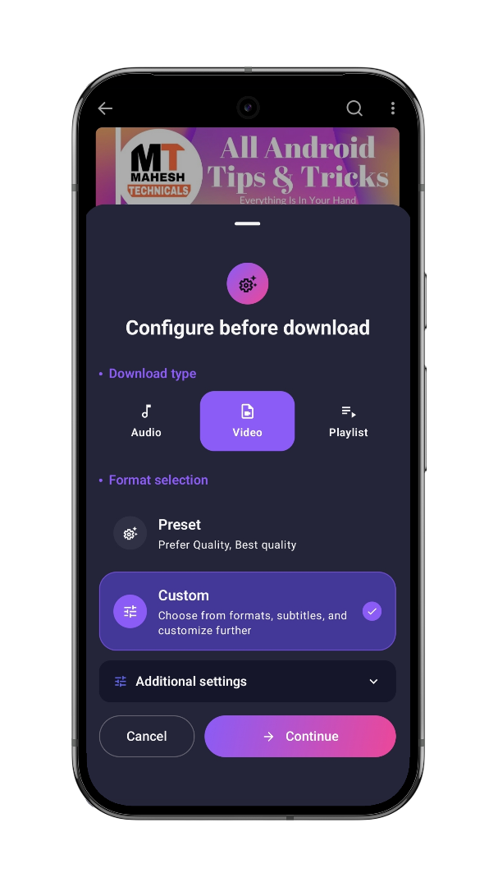
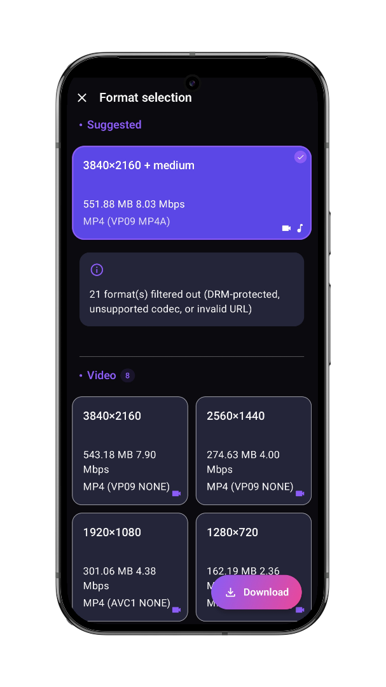
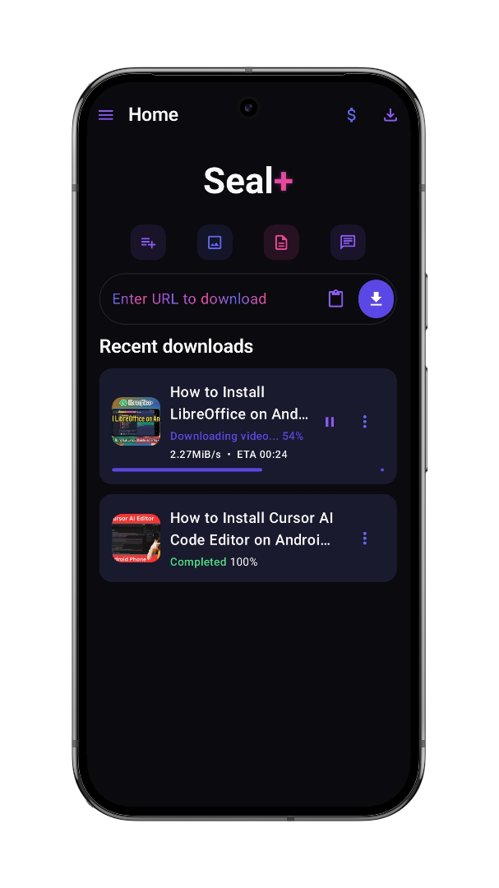
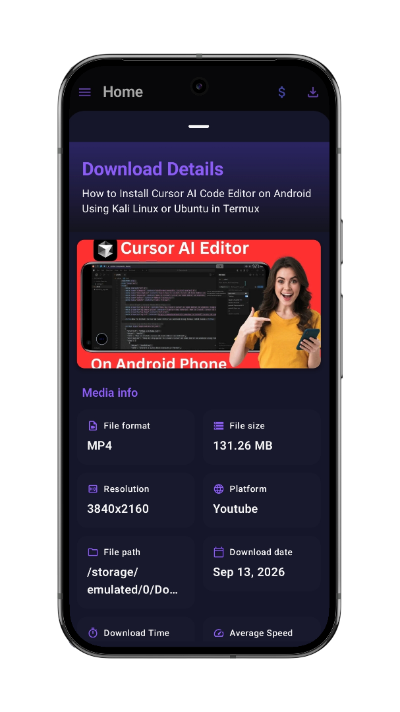
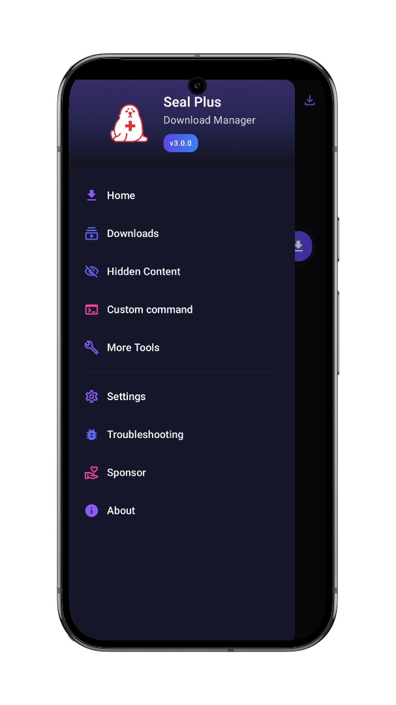
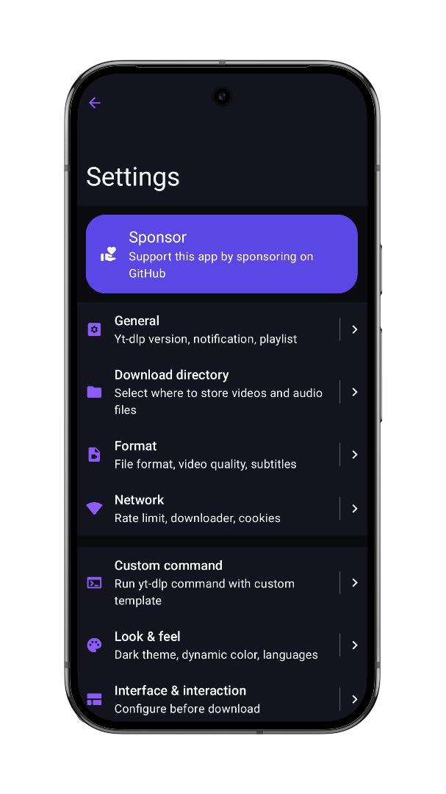
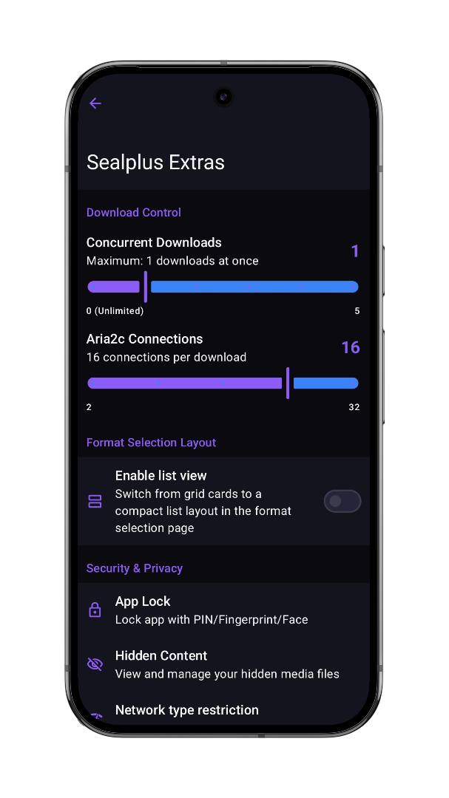
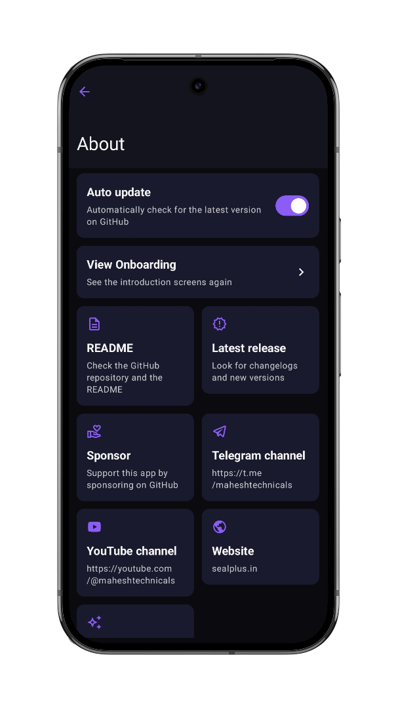

<div align="center">


# Seal Plus

### 🎬 Video/Audio Downloader for Android

[](https://github.com/MaheshTechnicals/Sealplus/releases/latest/)
[](https://github.com/MaheshTechnicals/Sealplus/releases/)
[](https://www.star-history.com/?repos=MaheshTechnicals%2FSealplus&type=date&legend=top-left)

A modern [Seal](https://github.com/JunkFood02/Seal) featuring custom themes, exclusive features and Material 3 design

---

### 🌐 Translations

🇬🇧
&nbsp;&nbsp;| &nbsp;&nbsp;
<a href="https://github.com/JunkFood02/Seal/blob/main/translations/README-zh_Hans.md">🇨🇳</a>
&nbsp;&nbsp;| &nbsp;&nbsp;
<a href="https://github.com/JunkFood02/Seal/blob/main/translations/README-zh_Hant.md">🇹🇼</a>
&nbsp;&nbsp;| &nbsp;&nbsp;
<a href="https://github.com/JunkFood02/Seal/blob/main/translations/README-ar.md">🇸🇦</a>
&nbsp;&nbsp;| &nbsp;&nbsp;
<a href="https://github.com/JunkFood02/Seal/blob/main/translations/README-pt.md">🇵🇹</a>
&nbsp;&nbsp;| &nbsp;&nbsp;
<a href="https://github.com/JunkFood02/Seal/blob/main/translations/README-ua.md">🇺🇦</a>
&nbsp;&nbsp;| &nbsp;&nbsp;
<a href="https://github.com/JunkFood02/Seal/blob/main/translations/README-th.md">🇹🇭</a>
&nbsp;&nbsp;| &nbsp;&nbsp;
<a href="https://github.com/JunkFood02/Seal/blob/main/translations/README-fa.md">🇮🇷</a>
&nbsp;&nbsp;| &nbsp;&nbsp;
<a href="https://github.com/JunkFood02/Seal/blob/main/translations/README-it.md">🇮🇹</a>
&nbsp;&nbsp;| &nbsp;&nbsp;
<a href="https://github.com/JunkFood02/Seal/blob/main/translations/README-ja.md">🇯🇵</a>
&nbsp;&nbsp;| &nbsp;&nbsp;
<a href="https://github.com/JunkFood02/Seal/blob/main/translations/README-hi.md">🇮🇳</a>
&nbsp;&nbsp;| &nbsp;&nbsp;
<a href="https://github.com/JunkFood02/Seal/blob/main/translations/README-bn.md">🇧🇩</a>

</div>

---

## ✨ Key Features

### 🎨 Premium UI & Theming
- **Gradient Dark Theme**
  - ⭐ *Exclusive to Seal Plus* — OLED-friendly dark backgrounds, vibrant gradients, glassmorphism, and smooth animations.
- **Material Design 3** — Dynamic colors, Dark/Light themes, and modern Compose components.

### 🎯 Core Download Capabilities
- **Universal Downloader** — Support for 1000+ platforms via [yt-dlp](https://github.com/yt-dlp/yt-dlp). ([Supported sites](https://github.com/yt-dlp/yt-dlp/blob/master/supportedsites.md))
- **High-Quality Audio Extraction** — Extract MP3, M4A, OPUS, FLAC, or WAV with metadata and thumbnail embedding via [mutagen](https://github.com/quodlibet/mutagen).
- **Playlist Support** — Download entire playlists with progress tracking, customizable naming, and resume support.
- **Subtitle Support** — Embed subtitles into videos or download them separately with multi-language support.

### ⚡ Advanced Features
- **High-Speed Downloads** — Embedded [aria2c](https://github.com/aria2/aria2) engine with multi-connection downloads, automatic retries, and resume support.
- **Custom Commands** — Create and save custom yt-dlp command templates with full CLI functionality.
- **Download Manager** — Track download history, search and filter downloads, share files, and perform batch operations.

### 🚀 Exclusive Seal Plus Features
- **Auto-Update System** — Automatic version checking, changelog display, and one-click APK updates.
- **Enhanced Community** — Access to [YouTube tutorials](https://youtube.com/@maheshtechnicals) and the [Telegram community](https://t.me/maheshtechnicals), with regular updates and support.

### 💻 Technical Excellence
- **Pure Kotlin Architecture** — Single Activity, 100% Jetpack Compose UI, Clean MVVM, and Kotlin Coroutines.
- **Modern Technology Stack** — Android SDK 37, Kotlin 2.3.21, Jetpack Compose BOM 2026.05.01, Room 2.8.4, and Material 3.
- **Performance Optimized** — Hardware-accelerated animations, efficient memory management, and battery-conscious background processing.

## 📱 Screenshots

<div align="center">
<div>

<br>

<br>

<br>

<br>


</div>
</div>

<br>

## ⬇️ Download & Installation
<div align="center">


<i>For most Android devices, install the **arm64-v8a** version for optimal performance.</i>
</div>

### 📱 Device Compatibility

| Requirement | Specification |
|------------|---------------|
| **Minimum Android** | Android 7.0 (API 24) |
| **Target Android** | Android 17 (API 37) |
| **Current Version** | 3.0.0 |
| **Release Date** | July 30, 2026 |

### 📋 Installation Instructions

1. **Download** the appropriate APK for your device architecture from [Releases](https://github.com/MaheshTechnicals/Sealplus/releases/latest)
2. **Enable** "Install from unknown sources" in Settings → Security
3. **Open** the downloaded APK file
4. **Follow** the installation prompts
5. **Grant** necessary permissions when launching the app
6. **Enjoy** seamless downloads!

> [!TIP]
> **Auto-Update Feature**: Once installed, Seal Plus will automatically check for updates. You'll be notified when new versions are available and can update with one click!

> [!WARNING]
> **Security Notice**: Always download Seal Plus exclusively from our [official GitHub releases page](https://github.com/MaheshTechnicals/Sealplus/releases). Never download from third-party sources to ensure you're getting the authentic, safe version.

---

## ❓ Frequently Asked Questions

<details>
<summary><b>📱 How do I enable Gradient Dark theme?</b></summary>

1. Open **Settings**
2. Go to **Look & Feel**
3. Enable **Dark Theme** (if not already on)
4. Toggle **Gradient Dark** switch
5. Enjoy the premium glassmorphism UI!

The theme features deep backgrounds with vibrant blue-purple gradients and smooth animations.
</details>

<details>
<summary><b>🔄 How does auto-update work?</b></summary>

Seal Plus automatically checks for updates from our GitHub releases:
- Enabled by default for all installations
- Checks when you open the app (not intrusive)
- Shows changelog before updating
- One-click download and install
- Can be disabled in Settings → About → Auto update

No need to manually check for updates anymore!
</details>

<details>
<summary><b>📥 Which architecture should I download?</b></summary>

| Architecture | Recommended For |
|--------------|-----------------|
| **arm64-v8a** | Most modern Android phones (2017+) - **Recommended** |
| **armeabi-v7a** | Older phones (2011-2017) |
| **x86_64** | Intel/AMD based devices, emulators |
| **x86** | Older Intel/AMD devices |
| **universal** | Works on all devices (larger file size) |

This project is tested with BrowserStack

**Don't know?** Download the **universal** APK - it works on all devices!
</details>

<details>
<summary><b>🌍 Can I use this to download from any website?</b></summary>

Seal Plus supports **1000+ platforms** via yt-dlp, including:
- ✅ YouTube, YouTube Music
- ✅ Instagram, TikTok, Twitter/X
- ✅ Facebook, Reddit, Vimeo
- ✅ Twitch, SoundCloud, Bandcamp
- ✅ Dailymotion, Bilibili, and many more!

[View complete list →](https://github.com/yt-dlp/yt-dlp/blob/master/supportedsites.md)
</details>

<details>
<summary><b>🎵 Can I extract only audio from videos?</b></summary>

Yes! Seal Plus has excellent audio extraction:
- Toggle "Save as audio" option
- Choose format (MP3, M4A, OPUS, etc.)
- Automatic metadata embedding
- Album art/thumbnail included
- Customizable quality settings

Perfect for music downloads and podcasts!
</details>

<details>
<summary><b>🔧 What's the difference between General and Custom Command modes?</b></summary>

**General Mode** (Easy):
- User-friendly interface
- Pre-configured options
- Automatic file organization
- Best for most users

**Custom Command Mode** (Advanced):
- Full yt-dlp CLI access
- Create and save templates
- Advanced configurations
- Terminal-like control

Choose based on your comfort level!
</details>

<details>
<summary><b>🔐 Is Seal Plus safe? Does it collect my data?</b></summary>

**Absolutely safe!**
- ✅ 100% open-source (view all code)
- ✅ No data collection or analytics
- ✅ No ads or trackers
- ✅ No internet permissions except for downloads
- ✅ All processing done locally on your device
- ✅ Licensed under GPL-3.0

You can verify everything in the [source code](https://github.com/MaheshTechnicals/Sealplus).
</details>

<details>
<summary><b>📱 What's the difference between Seal and Seal Plus?</b></summary>

**Seal Plus** is an enhanced fork with:
- 🎨 **Exclusive Gradient Dark Theme** with glassmorphism
- 🚀 **Auto-update system** enabled by default
- 📺 **Enhanced community** (YouTube, Telegram)
- 🔧 **Additional UI improvements** and optimizations
- 🎯 **Active maintenance** by Mahesh Technicals
- 🏆 **Latest tech stack** (Kotlin 2.0, Compose 2025, SDK 36)

Both are free and open-source!
</details>

<details>
<summary><b>❌ I'm getting download errors. What should I do?</b></summary>

Try these solutions:
1. **Update yt-dlp**: Settings → About → Update yt-dlp
2. **Check internet**: Ensure stable connection
3. **Clear cache**: Settings → Storage → Clear cache
4. **Try custom command**: Some sites need specific parameters
5. **Check site support**: Visit [supported sites list](https://github.com/yt-dlp/yt-dlp/blob/master/supportedsites.md)
6. **Report issue**: [GitHub Issues](https://github.com/MaheshTechnicals/Sealplus/issues) with details

Most issues are resolved by updating yt-dlp!
</details>

---

## 💬 Community & Support

### 🌐 Join Our Community

Stay connected with the Seal Plus community and get support:

- **📺 YouTube Channel**: [Mahesh Technicals](https://youtube.com/@maheshtechnicals)
  - Video tutorials and feature demonstrations
  - Tips and tricks for advanced usage
  - Update announcements and previews

- **💬 Telegram Channel**: [Join @maheshtechnicals](https://t.me/maheshtechnicals)
  - Latest updates and announcements
  - Quick community support
  - Direct developer interaction
  - Beta testing opportunities

### 🐛 Bug Reports & Feature Requests

We value your feedback! Help us improve Seal Plus:

1. **Check First**: Browse [existing issues](https://github.com/MaheshTechnicals/Sealplus/issues) to avoid duplicates
2. **Read Guidelines**: Review our [Contributing Guidelines](https://github.com/MaheshTechnicals/Sealplus/blob/main/CONTRIBUTING.md)
3. **Report Issues**: Open a [new issue](https://github.com/MaheshTechnicals/Sealplus/issues/new) with:
   - Clear description of the problem/feature
   - Steps to reproduce (for bugs)
   - Your device model and Android version
   - App version and build variant
   - Screenshots or screen recordings (if applicable)

### 📖 Documentation & Resources

- **📋 Changelog**: [View all changes and updates](https://github.com/MaheshTechnicals/Sealplus/blob/main/CHANGELOG.md)
- **🌍 Supported Sites**: [Full list of 1000+ supported platforms](https://github.com/yt-dlp/yt-dlp/blob/master/supportedsites.md)
- **🎨 Gradient Dark Theme**: [Complete documentation](https://github.com/MaheshTechnicals/Sealplus/blob/main/GRADIENT_DARK_README.md)
- **📖 Contributing Guide**: [How to contribute](https://github.com/MaheshTechnicals/Sealplus/blob/main/CONTRIBUTING.md)

## 💖 Support Seal Plus

### ❤️ Show Your Support

Seal Plus is **100% free and open-source** software, built with passion by the community. Here's how you can help:

| Action | Impact |
|--------|--------|
| ⭐ **Star this repo** | Help others discover Seal Plus |
| 📺 **Subscribe on YouTube** | Get tutorials and update notifications |
| 💬 **Join Telegram** | Connect with the community |
| 🐛 **Report bugs** | Help us fix issues faster |
| 💡 **Suggest features** | Shape the future of Seal Plus |
| 🌍 **Translate** | Make it accessible worldwide |
| 📢 **Share** | Tell your friends about Seal Plus |

### 🎉 Special Thanks

A huge thank you to:
- **[JunkFood02](https://github.com/JunkFood02)** and all [original Seal contributors](https://github.com/JunkFood02/Seal/graphs/contributors)
- **All sponsors** supporting the original Seal project
- **Our community members** providing feedback and bug reports
- **Translators** making Seal Plus accessible worldwide
- **Everyone** who has starred, shared, or used Seal Plus

Your contributions and support make this project possible! 🙏

## 🤝 Contributing to Seal Plus

We welcome all contributions! Whether you're a developer, designer, translator, or user, there's a way for you to help.

### 🌍 Translations

Help make Seal Plus accessible to users worldwide:

- **Contribute**: Visit [Hosted Weblate](https://hosted.weblate.org/projects/seal/) to add or improve translations
- **Current Status**: 

[](https://hosted.weblate.org/engage/seal/)

### 💻 Code Contributions

#### Getting Started
1. **Fork** the repository
2. **Clone** your fork: `git clone https://github.com/YOUR_USERNAME/Seal.git`
3. **Create** a feature branch: `git checkout -b feature/amazing-feature`
4. **Make** your changes
5. **Test** thoroughly on multiple devices
6. **Commit** with clear messages: `git commit -m "Add amazing feature"`
7. **Push** to your fork: `git push origin feature/amazing-feature`
8. **Open** a Pull Request with detailed description

#### Development Environment
```bash
# Requirements
- Android Studio Ladybug or later
- JDK 17 or later
- Android SDK 24-36
- Gradle 8.13+

# Build
./gradlew assembleRelease

# Debug Build
./gradlew assembleDebug
```

### 📋 Contribution Guidelines

> [!IMPORTANT]
> Before contributing, please read our [Contributing Guidelines](https://github.com/MaheshTechnicals/Sealplus/blob/main/CONTRIBUTING.md) for:
> - Code style standards
> - Commit message conventions
> - Pull request requirements
> - Feature request process
> - Bug report templates

### 🏗️ Technology Stack

| Component | Technology | Version |
|-----------|-----------|---------|
| **Language** | Kotlin | 2.3.21 |
| **UI Framework** | Jetpack Compose | 2026.05.01 |
| **Architecture** | MVVM + Clean Architecture | - |
| **Build System** | Gradle (KTS) | 9.5.1 |
| **Minimum SDK** | Android 7.0 | API 24 |
| **Target SDK** | Android 17 | API 37 |
| **Database** | Room | 2.8.4 |
| **Async** | Kotlin Coroutines | 1.11.0 |
| **Networking** | OkHttp | 4.12.0 |
| **Image Loading** | Coil 3 | 3.4.0 |
| **DI** | Koin | 4.2.1 |

## ⭐ Star History

Watch how our community has grown over time!

<a href="https://www.star-history.com/?repos=MaheshTechnicals%2FSealplus&type=date&legend=top-left">
 <picture>
   <source media="(prefers-color-scheme: dark)" srcset="https://api.star-history.com/chart?repos=MaheshTechnicals/Sealplus&type=date&theme=dark&legend=top-left&sealed_token=GOlb1s7yaOu_jIlZC6RgDlzDCmd8ES-3lqcTtDciPQFpy_uLPyxWkX0aE9zzzfmENuI1HsIHaIO247uaLgCSijoYhEkKo0CWE1en_LqiTZfObqGgZSLzgw" />
   <source media="(prefers-color-scheme: light)" srcset="https://api.star-history.com/chart?repos=MaheshTechnicals/Sealplus&type=date&legend=top-left&sealed_token=GOlb1s7yaOu_jIlZC6RgDlzDCmd8ES-3lqcTtDciPQFpy_uLPyxWkX0aE9zzzfmENuI1HsIHaIO247uaLgCSijoYhEkKo0CWE1en_LqiTZfObqGgZSLzgw" />
   
 </picture>
</a>

---

## 🙏 Acknowledgments & Credits

Seal Plus stands on the shoulders of giants. We're grateful to these amazing open-source projects and contributors:

### 🏆 Core Technologies

| Project | Description | License |
|---------|-------------|---------|
| **[yt-dlp](https://github.com/yt-dlp/yt-dlp)** | Powerful video downloader engine | Unlicense |
| **[youtubedl-android](https://github.com/yausername/youtubedl-android)** | Android wrapper for yt-dlp | GPL-3.0 |
| **[aria2](https://github.com/aria2/aria2)** | High-speed download utility | GPL-2.0 |
| **[mutagen](https://github.com/quodlibet/mutagen)** | Audio metadata handler | GPL-2.0 |

### 🎨 Design & UI Inspiration

| Project | Inspiration | Author |
|---------|-------------|--------|
| **[Seal](https://github.com/JunkFood02/Seal)** | Original foundation | [JunkFood02](https://github.com/JunkFood02) |
| **[Read You](https://github.com/Ashinch/ReadYou)** | UI patterns & components | [Ashinch](https://github.com/Ashinch) |
| **[Music You](https://github.com/Kyant0/MusicYou)** | Design aesthetic | [Kyant0](https://github.com/Kyant0) |
| **[dvd](https://github.com/yausername/dvd)** | Additional utilities | [yausername](https://github.com/yausername) |

### 🌈 Material Design System

| Library | Purpose |
|---------|---------|
| **[Material Color Utilities](https://github.com/material-foundation/material-color-utilities)** | Dynamic color theming |
| **[Monet](https://github.com/Kyant0/Monet)** | Color scheme generation |
| **[Material 3 Components](https://m3.material.io/)** | Modern UI components |

### 🎯 Seal Plus Exclusive Features

**Gradient Dark Theme** - Premium UI mode with glassmorphism effects
- Designed and implemented by [Mahesh Technicals](https://github.com/MaheshTechnicals)
- 21 new resource files and components
- 2,200+ lines of documentation
- [View Implementation Guide](https://github.com/MaheshTechnicals/Sealplus/blob/main/GRADIENT_DARK_IMPLEMENTATION_GUIDE.md)

### 🌟 Original Creator

**[JunkFood02](https://github.com/JunkFood02)** - Creator of the original Seal project
- Thank you for building an amazing foundation
- Seal Plus is an enhanced fork with additional features
- All [original contributors](https://github.com/JunkFood02/Seal/graphs/contributors) deserve recognition

### 🌍 Community Contributors

- **Translators** on [Weblate](https://hosted.weblate.org/projects/seal/) - Making Seal Plus accessible worldwide
- **Beta Testers** - Helping us catch bugs early
- **Issue Reporters** - Providing valuable feedback
- **Feature Suggesters** - Shaping the roadmap
- **All Contributors** to [Seal Plus](https://github.com/MaheshTechnicals/Sealplus/graphs/contributors)

### 💝 Special Recognition

This project wouldn't be possible without the collective efforts of the open-source community. Every contribution, no matter how small, makes a difference. Thank you all! 🙏

## 📃 License

[](https://github.com/MaheshTechnicals/Sealplus/blob/main/LICENSE)

>[!Warning]
>
>Except for the source code licensed under the GPLv3 license,
>all other parties are prohibited from using Seal's name as a downloader app,
>and the same is true for Seal's derivatives.
>Derivatives include but are not limited to forks and unofficial builds.

<div align="right">
<table><td>
<a href="#start-of-content">👆 Scroll to top</a>
</td></table>
</div>
